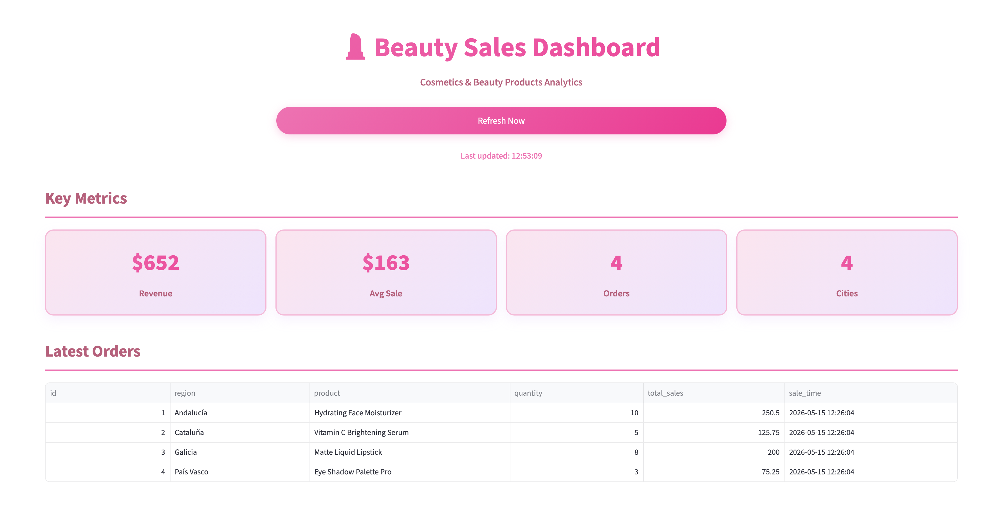
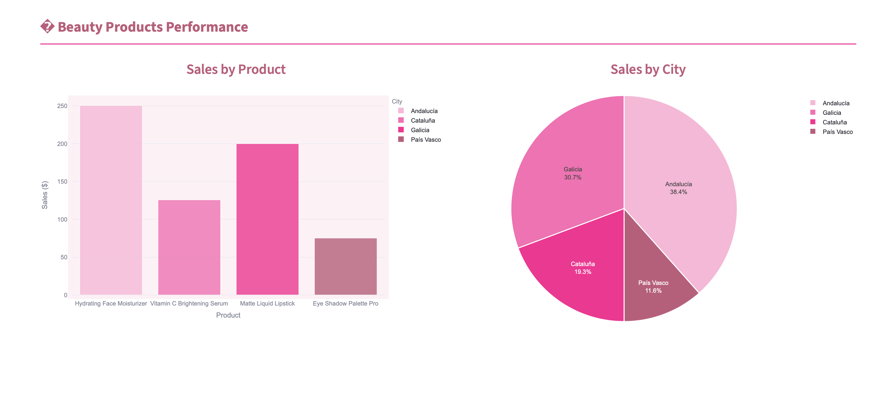

# Beauty Sales Dashboard

A modern, feminine Streamlit dashboard for tracking beauty product sales in real time.

## Overview

This dashboard shows live sales data for beauty products across major cities. It includes:

-  Beauty product sales metrics
-  Product performance charts
-  Regional/city sales distribution
-  Manual refresh and auto-refresh support

## Files

- `dashboard_app.py` — Streamlit dashboard app
- `simulate_sales.py` — sample sales generator script
- `create_databaes_of sales.txt` — database schema and seed data
- `asstes/` — screenshot image files used in this README

## Setup

1. Create your PostgreSQL database and user if needed.
2. Update the database connection strings in `dashboard_app.py` and `simulate_sales.py`.
3. Install required Python packages in your virtual environment:

```bash
pip install streamlit pandas plotly sqlalchemy psycopg2-binary
```

4. Run the dashboard:

```bash
streamlit run dashboard_app.py
```

5. (Optional) Run the simulator to insert new sample sales data:

```bash
python simulate_sales.py
```

## Screenshots

### Dashboard screenshot 1



### Dashboard screenshot 2



